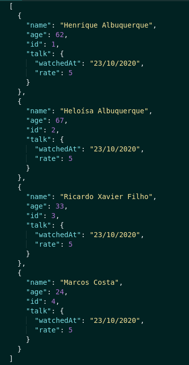
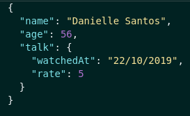

<h1>Talker Manager</h1>

  Talker manage is a CRUD API. It was built using NodeJS and Express for read and write files using fs module.
  The user can Create, Read, Update and Delete talkers.

<h2>
 Built With
</h2>

 - NodeJS 

 - Express 

 - Conventional commits (extension) 

<h2>
  Endpoints
</h2>

<h3> - GET </h3>
 

 
<strong> /talker </strong>

 Get all talkers 

<strong> Parameters: No parameters </strong>
   
<strong> Response: </strong>

 Status: 200 

<strong> /talker/:id </strong>

 Get talker by id 

<strong> Parameters: No parameters </strong>
  
<strong> Response: </strong>

 Status: 200 

 Status: 404 

<strong> /talker/search?q=searchTerm </strong>

 Get talkers by term 

<strong> Response: </strong>
 

 Status: 200 

 If not found anyone with the search term return all talkers 

 Status: 401 

 - token not found 

 - invalid token 

<h3> - POST </h3>
 

<strong> /login </strong>

 Do login and recive a token 

<strong> Parameters: </strong>

 - body 

<strong> Response: </strong>

 Status: 200 

 Status: 400 

 - password is required 

 - email is required 

 - password must be at least 6 characters 

 - email must be like email@email.com 

<strong> /talker </strong>

 Create new talker 

<strong> Parameters: </strong>

 - body 

 - headers 

 authorization: 2zg4lua9ley7hdq5 

<strong> Response: </strong>

 Status: 201 

 Status: 401 

 - token not found 

 - invalid token 

 Status: 400 

 - name is required 

 - name must be at least 3 characters 

 - age is required 

 - age must be greater than 18 

 - talk is required 

 - watchedAt is required 

 - watchedAt must be like "dd/mm/aaaa" 

 - rate is required 

 - rate must be a integer from 1 to 5 

<h3> - PUT </h3>
 

<strong> /talker:id </strong>

 Update a talker by id

<strong> Parameters: </strong>

 - body 

 - headers 

 authorization: 2zg4lua9ley7hdq5 

<strong> Response: </strong>

 Status: 200 

 Status: 401 

 - token not found 

 - invalid token 

 Status: 400 

 - name is required 

 - name must be at least 3 characters 

 - age is required 

 - age must be greater than 18 

 - talk is required 

 - watchedAt is required 

 - watchedAt must be like "dd/mm/aaaa" 

 - rate is required 

 - rate must be a integer from 1 to 5 

<h3> - DELETE </h3>
 

 
<strong> /talker:id </strong>

 Delete a talker by id

<strong> Parameters: No parameters </strong>
   
<strong> Response: </strong>

 Status: 204 

 Status: 401 

 - token not found 

 - invalid token 

<h2>
  How try the application?
</h2>

  1. First run <code>npm install</code> to install all dependencies of project.  
  2. If you don´t have any client extension to do the requestions download <code>Thunder Client</code> extension on VS Code. 
  3. Run <code>npm start</code>. 
  4. Select the method on thunder client. 
  5. Do requisitions on thunder client using the URL shape http://localhost:3000/endpoint.
   
   
  Just it, enjoy!

